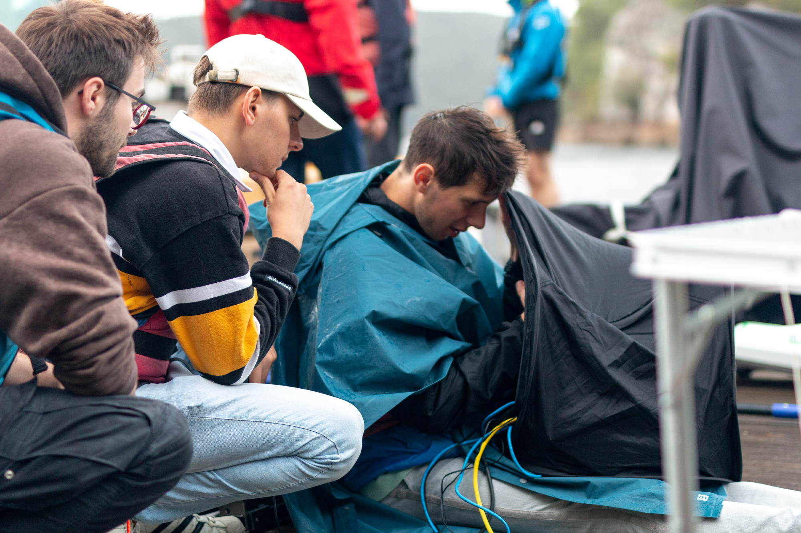
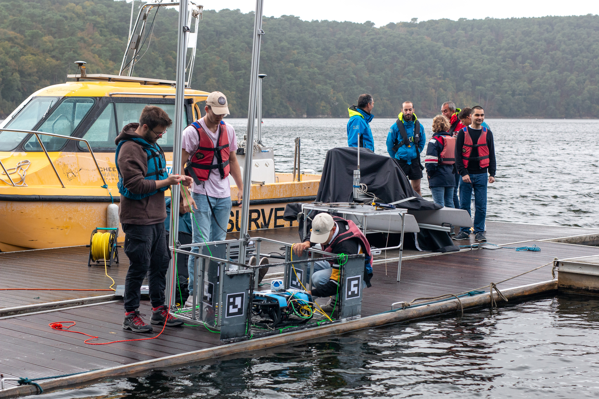

## Objectifs du projet

Le projet consiste à réaliser un robot capable de retourner à sa base de façon précise, voire de se docker avec un appendice de cette base en totale autonomie.
Ce projet a été réalisé sous ROS2 Humble, il est adapté pour un robot de type [BlueRov](https://bluerobotics.com/store/rov/bluerov2/).




*L'équipe au Lac de Guerlédan*

### Vue générale
- **open_cv** : Un package permettant le traitement d'images.
- **joint_state_publisher**: Un package permettant de publier l'état des joints d'un robot pour la visualisation et la simulation.
- **robot_state_publisher**: Un package utilisé pour diffuser la cinématique d'un robot à partir de fichiers URDF dans le système ROS.
- **robot_localization**: Un package pour la fusion de capteurs et l'estimation de l'état du robot dans le contexte de la navigation robotique.
- **rviz**: Un outil de visualisation 3D interactif pour la visualisation en temps réel de données robotiques, telles que des capteurs, des cartes et des modèles robotiques.
- **xacro**: Un outil permettant de simplifier la création et la gestion des descriptions de robots URDF en utilisant une syntaxe XML simplifiée et extensible.

### Télécharger les dépendences
Commencez par sourcer ROS2 Humble
```bash
source /opt/ros/humble/setup.bash
```

Ensuite vous pouvez télécharger les dépendances avec ces commandes :
```bash
sudo apt-get install ros-humble-joint-state-publisher
sudo apt-get install ros-humble-robot-state-publisher
sudo apt-get install ros-humble-rviz2
sudo apt-get install ros-humble-xacro
sudo apt-get install ros-humble-joy
```

### Démarrer la simulation avec ROS 2

Commencez par build les packages :

```bash
source /opt/ros/humble/setup.bash
cd ~/ros2_ws/
colcon build
source install/setup.bash
```

Lancez la simulation :

```bash
ros2 launch niche display.launch.py
```

Le robot se déplace grâce au joystick de droite de la télécommande :

- Le robot avance/recule si l'utilisateur avance/recule le joystick
- Le robot tourne à gauche/droite si le joystick va vers la gauche/droite

## Groupe

### Membres

- [Mathieu PITAUD](mailto:mathieu.pitaud@ensta-bretagne.org)
- [Jules LeGouallec](mailto:jules.le_gouallec@ensta-bretagne.org)
- [Mathys SERY](mailto:mathys.sery@ensta-bretagne.org)
- [Titouan BELIER](mailto:titouan.belier@ensta-bretagne.org)

### Gestion de projet

Lien vers notre gestionnaire de projet Agile : [Taïga](https://tree.taiga.io/project/titou2222-niche/timeline).

## Structure du dépôt

Le dépôt contient plusieurs dossiers :

- Un dossier 'Debriefs'
- Un dossier contenant les images
- Un dossier contenant les sources ros2

### Dossier debriefs

Le dossier `Debriefs` est un dossier contenant les différents compte-rendus des réunions avec notre encadrant ainsi que les rapports écrits au cours du projet.

### Dossier ros2_ws/src

Ce dossier contient les packages ROS2 Humble nécessaires au fonctionnement du robot :

- Un package `niche`, contenant la simulation et les sources du robot en lui-même comme l'URDF.
- un package `camera_simulation`, contenant le guidage du robot avec la caméra sous Gazebo.
- Un package `my_robot_control`, un package pour le contrôle à la télécommande.
- Un dossier avec des programmes utiles `Tools`.

### Dossier Images

Le dossier img contient toutes les images que l'on peut montrer au client, ou afficher sur le README.md.


## Détails techniques

* **masse du robot** : kg
* **dimensions du robot** : 
* **autonomie moyenne du robot** : min
